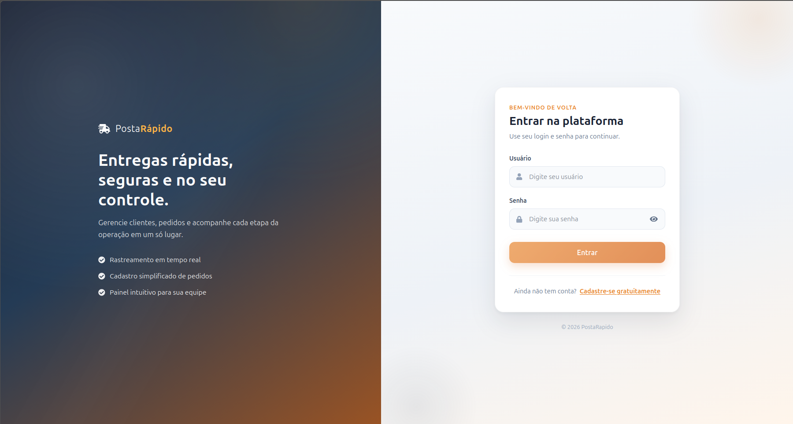
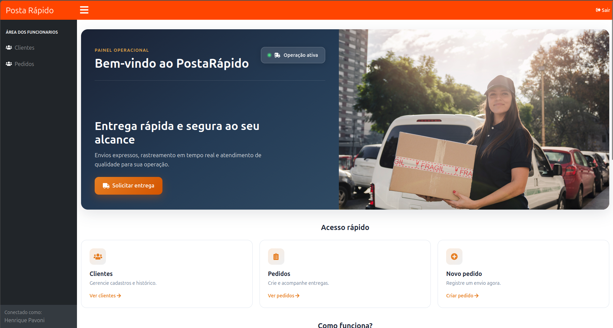
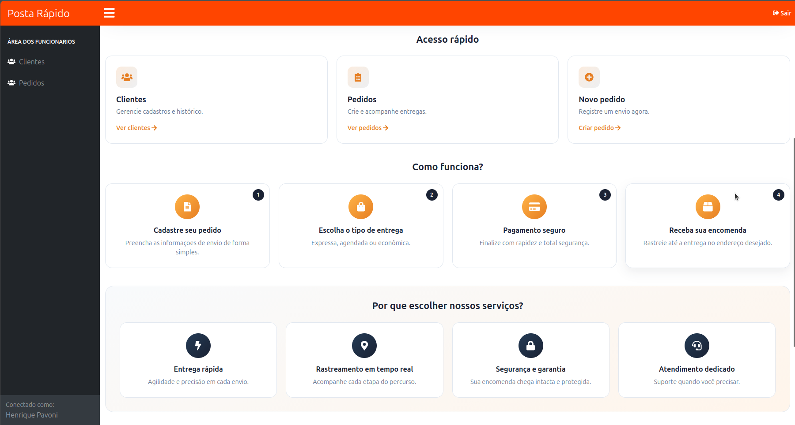
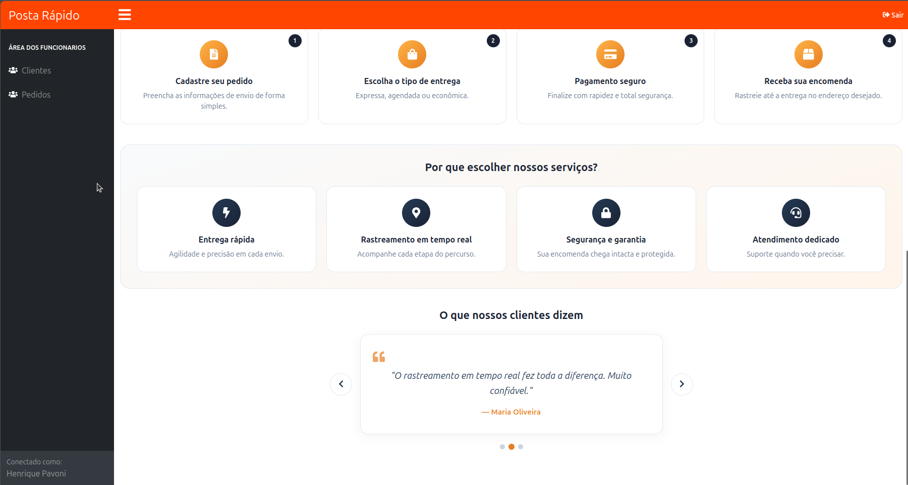
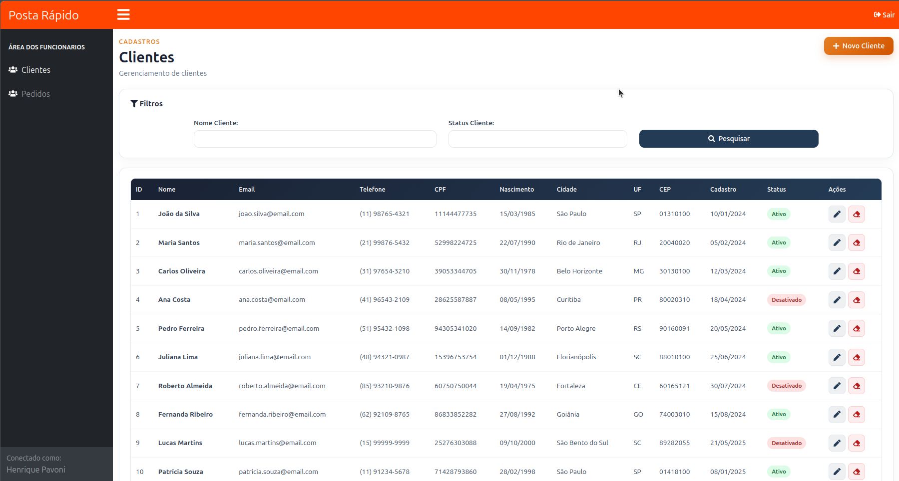
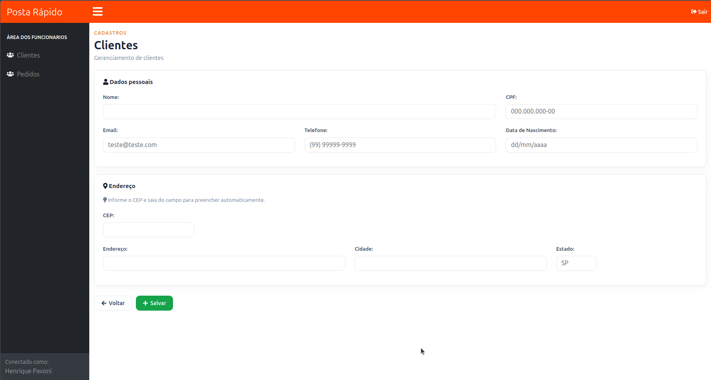
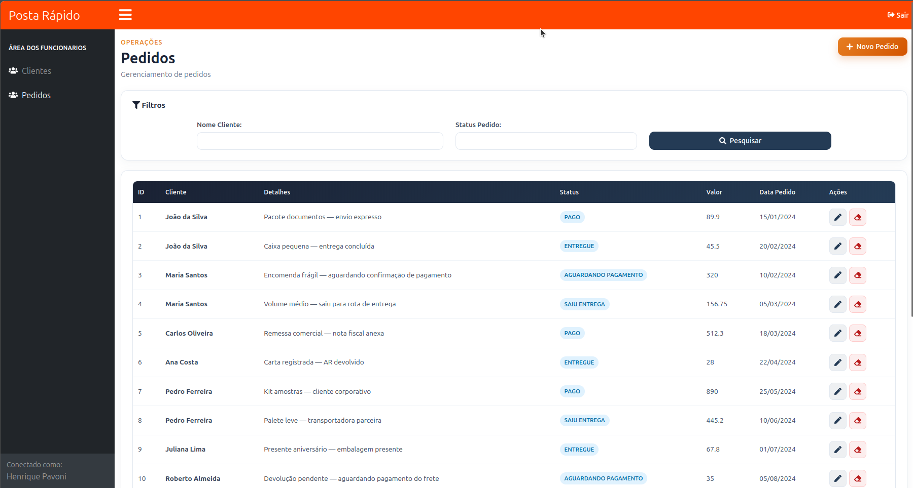
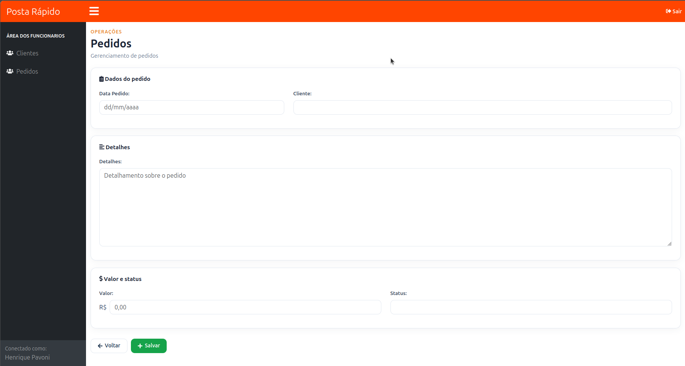

# PostaRapido

Aplicação full stack para simulação de um fluxo operacional de gestão de entregas, com cadastro de clientes, registro de pedidos, controle de status e área autenticada para funcionários.

## Sobre o projeto

O **PostaRapido** simula a operação de uma empresa de entregas expressas, permitindo que a equipe gerencie clientes, crie pedidos e acompanhe o andamento de cada envio em um painel web. O objetivo técnico foi construir uma aplicação completa — com frontend e backend separados, regras de negócio na API, persistência relacional e autenticação protegida por JWT.

## Capturas de tela

### Login e cadastro de usuário

Tela de autenticação com opção de registro de novos usuários.

<p align="center">
  
</p>

### Painel operacional

Dashboard inicial com acesso rápido aos módulos de clientes e pedidos.

<p align="center">
  
</p>

<p align="center">
  
</p>

<p align="center">
  
</p>

### Gestão de clientes

Listagem com filtros, status e formulário com preenchimento automático de endereço via CEP.

<p align="center">
  
</p>

<p align="center">
  
</p>

### Gestão de pedidos

Listagem com filtros por cliente e status, além de formulário para criação e edição.

<p align="center">
  
</p>

<p align="center">
  
</p>

## Funcionalidades

- Autenticação de usuários com login, registro e logout
- Proteção de rotas no frontend com guards e envio automático do token JWT via interceptor
- Cadastro, edição, exclusão e listagem de clientes
- Filtro de clientes por nome e status (Ativo / Desativado)
- Validação de CPF, e-mail e campos obrigatórios no backend
- Preenchimento automático de endereço a partir do CEP (integração com ViaCEP)
- Máscaras de entrada para CPF, telefone, CEP e valores monetários no frontend
- Cadastro, edição, exclusão e listagem de pedidos
- Filtro de pedidos por nome do cliente e status
- Controle de status do pedido: Aguardando Pagamento, Pago, Saiu Para Entrega e Entregue
- Painel operacional com navegação entre módulos e identificação do usuário conectado
- Tratamento centralizado de erros da API

## Tecnologias utilizadas

- **Linguagem:** Java 17, TypeScript
- **Framework/Biblioteca:** Spring Boot 3.4, Angular 9, Spring Security, Spring Data JPA, Hibernate
- **Banco de dados:** PostgreSQL 15
- **Estilização:** Bootstrap 5, CSS customizado
- **Ferramentas:** Maven, Angular CLI, Docker, Docker Compose, Git, GitHub
- **Testes:** JUnit (backend), Jasmine/Karma (frontend)
- **Integrações:** ViaCEP (consulta de endereço por CEP)
- **Outros recursos:** autenticação JWT (Auth0 java-jwt), BCrypt para senhas, validação Bean Validation, lazy loading de módulos Angular, internacionalização de mensagens de erro

## Como executar o projeto

### Pré-requisitos

- Java 17+
- Node.js e npm
- Maven
- Docker e Docker Compose

### 1. Clone o repositório

```bash
git clone git@github.com:HenriquePavoni/PostaRapido.git
cd PostaRapido
```

### 2. Suba o banco de dados

Na pasta da API, inicie o PostgreSQL com Docker Compose. O container expõe a porta `5433` e carrega os dados iniciais a partir do script `backup.sql`.

```bash
cd postaRapidoApi/postaRapidoApi
docker compose up -d
```

### 3. Configure variáveis de ambiente (opcional)

A API utiliza um segredo JWT definido em `application.properties`. Para sobrescrever em ambiente local:

```bash
export JWT_SECRET=sua_chave_secreta_base64
```

Credenciais padrão do banco (já configuradas no projeto):

| Variável | Valor |
|---|---|
| URL | `jdbc:postgresql://localhost:5433/postgres` |
| Usuário | `postgres` |
| Senha | `password` |

### 4. Execute a API (backend)

```bash
cd postaRapidoApi/postaRapidoApi
./mvnw spring-boot:run
```

A API ficará disponível em `http://localhost:8080`.

### 5. Execute o frontend

Em outro terminal:

```bash
cd postaRapido
npm install
npm start
```

A aplicação Angular ficará disponível em `http://localhost:4200`.

### 6. Acesse a aplicação

1. Abra `http://localhost:4200`
2. Cadastre um usuário ou faça login com credenciais existentes no banco
3. Navegue pelos módulos **Clientes** e **Pedidos** pelo menu lateral

## Organização do projeto

O repositório está dividido em duas aplicações principais:

```
PostaRapido/
├── postaRapido/                  # Frontend Angular
│   └── src/app/
│       ├── clientes/             # Módulo de clientes (listagem, formulário, rotas)
│       ├── pedidos/              # Módulo de pedidos (listagem, formulário, rotas)
│       ├── login/                # Tela de autenticação e registro
│       ├── home/                 # Painel operacional
│       ├── layout/               # Shell da aplicação autenticada
│       ├── template/             # Navbar e sidebar
│       ├── shared/               # Diretivas reutilizáveis (máscaras)
│       ├── auth.service.ts       # Comunicação com /api/auth
│       ├── auth.guard.ts         # Proteção de rotas autenticadas
│       ├── auth.interceptor.ts   # Inclusão do token JWT nas requisições
│       └── *.service.ts          # Serviços HTTP para clientes, pedidos e CEP
│
├── postaRapidoApi/postaRapidoApi/   # Backend Spring Boot
│   └── src/main/java/.../postaRapidoApi/
│       ├── control/              # Controllers REST (auth, clientes, pedidos, cep)
│       ├── service/              # Regras de negócio e integrações
│       ├── repository/           # Acesso aos dados com JPA
│       ├── model/                # Entidades, DTOs e enums
│       ├── config/               # Segurança, filtros JWT e i18n
│       └── exception/            # Tratamento padronizado de erros
│
└── docs/screenshots/             # Capturas de tela da aplicação
```

**Backend:** controllers recebem as requisições HTTP, services concentram a lógica (incluindo consulta ao ViaCEP e autenticação), repositories persistem no PostgreSQL e a camada de configuração aplica Spring Security com JWT stateless.

**Frontend:** componentes de interface organizados por feature module, serviços Angular para consumo da API, guards para controle de acesso e layout compartilhado com navbar e sidebar.

## O que este projeto demonstra

- Construção de uma aplicação full stack com fluxo completo de autenticação e CRUD
- Organização de código por responsabilidade (controllers, services, repositories, modules, components)
- Aplicação de regras de negócio e validação de dados no backend
- Persistência relacional com JPA/Hibernate e PostgreSQL
- Proteção de endpoints com Spring Security e tokens JWT
- Consumo de API externa (ViaCEP) para enriquecimento de dados
- Interface responsiva com Angular, Bootstrap e lazy loading de módulos
- Estruturação de um projeto para facilitar manutenção e evolução

## Melhorias futuras

- Adicionar testes automatizados de integração e e2e com maior cobertura
- Criar documentação da API com Swagger/OpenAPI
- Implementar paginação e ordenação nas listagens
- Adicionar perfis de acesso (admin, operador) com autorização por role
- Centralizar a URL da API em variáveis de ambiente do Angular
- Implementar rastreamento real de entregas com histórico de status
- Configurar pipeline de CI/CD e deploy da aplicação
