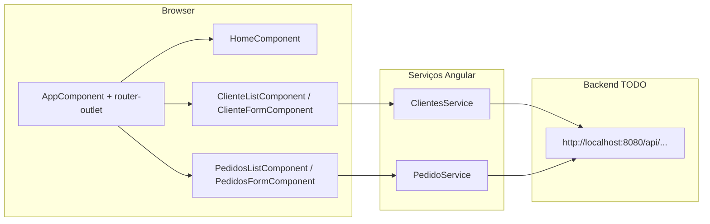

# Documentação técnica — PostaRapido

Documentação gerada com base no código e na configuração do repositório `postaRapido`. Para caminhos absolutos do projeto, o diretório raiz considerado é o que contém `package.json` e `angular.json`.

## 1) Visão geral do sistema

O **PostaRapido** (`posta-rapido` em `package.json`) é uma aplicação web **SPA** construída com **Angular 9** e **Angular CLI 9.1.1**. A interface usa **Bootstrap 5** e **jQuery** (conforme `angular.json`), com layout de navegação lateral e barra superior (`TemplateModule`).

Do ponto de vista funcional evidenciado no código, o sistema oferece:

- Uma **página inicial** (`HomeComponent`) com conteúdo institucional de entregas.
- **Cadastro e gestão de clientes** (`ClientesModule`): listagem e formulário com rotas filhas.
- **Cadastro e gestão de pedidos** (`PedidosModule`): listagem e formulário com rotas filhas.

A persistência e regras de negócio **não** estão neste repositório: o front-end consome uma **API HTTP** em `http://localhost:8080` através de `HttpClient`, conforme `ClientesService` e `PedidoService`.

## 2) Arquitetura e fluxo principal

O arranque da aplicação segue o padrão Angular: `src/main.ts` chama `platformBrowserDynamic().bootstrapModule(AppModule)` e, em produção, `enableProdMode()` conforme `environment.production`.

O fluxo típico no browser:

1. O utilizador navega por rotas definidas em `AppRoutingModule` (raiz) e nos módulos de funcionalidade (`ClientesRoutingModule`, `PedidosRoutingModule`).
2. Os ecrãs interagem com `ClientesService` e `PedidoService`, que executam pedidos **GET**, **POST**, **PUT** e **DELETE** para endpoints sob `http://localhost:8080/api/...`.
3. O `router-outlet` em `AppComponent` apresenta o componente ativo; a navegação lateral (`sidebar.component.html`) liga a `/cliente-list` e `/pedidos-list`.

Ficheiros `src/environments/environment.ts` e `environment.prod.ts` expõem apenas o indicador `production`. **A URL base da API não está centralizada nestes ficheiros**; está repetida nos serviços HTTP.

## 3) Módulos/componentes principais

| Área | Ficheiros / símbolos (identificadores do código) | Papel |
|------|--------------------------------------------------|--------|
| Raiz da app | `AppModule`, `AppComponent`, `AppRoutingModule` | Arranque, `HttpClientModule`, registo de `LOCALE_ID` como `pt-BR`, importação dos módulos de domínio e do template. |
| Template | `TemplateModule`, `NavbarComponent`, `SidebarComponent` | Cabeçalho, menu lateral e ligações `routerLink`. |
| Home | `HomeComponent` | Rota `''` e `home`. |
| Clientes | `ClientesModule`, `ClienteListComponent`, `ClienteFormComponent`, `ClientesRoutingModule`, modelo `Cliente` | Rotas: `cliente-list`, `cliente-form`, `cliente-form/:status/:id`. |
| Pedidos | `PedidosModule`, `PedidosListComponent`, `PedidosFormComponent`, `PedidosRoutingModule`, modelo `Pedido` | Rotas: `pedidos-list`, `pedidos-form`, `pedidos-form/:status/:id`. |
| Serviços HTTP | `ClientesService`, `PedidoService` | Chamadas à API REST documentadas na secção 4. |

## 4) Interfaces públicas (APIs, eventos, contratos)

Esta secção descreve apenas o **contrato HTTP consumido pelo front-end**, tal como codificado (base fixa `http://localhost:8080`). O backend não faz parte deste repositório; comportamento de erro, esquemas de resposta e CORS são **TODO/Não identificado** aqui.

### Clientes (`ClientesService`)

- `POST http://localhost:8080/api/clientes` — corpo: `Cliente`
- `GET http://localhost:8080/api/clientes`
- `GET http://localhost:8080/api/clientes/{id}`
- `PUT http://localhost:8080/api/clientes/{id}` — corpo: `Cliente` com `id`
- `DELETE http://localhost:8080/api/clientes/{id}`

Modelo `Cliente` (`src/app/clientes/cliente.ts`): `id`, `nome`, `email`, `telefone`, `cpf`, `dataNascimento`, `endereco`, `cidade`, `estado`, `cep`, `dataCadastro`, `ativo`.

### Pedidos (`PedidoService`)

- `GET http://localhost:8080/api/pedido`
- `GET http://localhost:8080/api/pedido/{id}`
- `POST http://localhost:8080/api/pedido` — corpo: `Pedido`
- `PUT http://localhost:8080/api/pedido/{id}` — corpo: `Pedido` com `id`
- `DELETE http://localhost:8080/api/pedido/{id}`

Modelo `Pedido` (`src/app/pedidos/pedido.ts`): `id`, `cliente` (`Cliente`), `dataPedido`, `status`, `detalhes`, `valor`.

**Eventos** (mensagens entre sistemas, filas, WebSockets): **TODO/Não identificado** neste repositório.

## 5) Como executar, testar e fazer deploy (se identificado)

### Pré-requisitos

- Node.js e npm compatíveis com o ecossistema Angular 9 (versões exatas **TODO/Não identificado** no repositório; o projeto declara `@types/node` ^12.11.1 em `devDependencies`).

### Instalação e servidor de desenvolvimento

```bash
npm install
npm start
```

`npm start` executa `ng serve`. O `README.md` da raiz indica `http://localhost:4200/` como URL por omissão.

### Build de produção

```bash
npm run build
```

O `angular.json` define `outputPath` como `dist/postaRapido` e substitui `environment.ts` por `environment.prod.ts` na configuração `production`.

### Testes

- Unitários: `npm test` (`ng test`, Karma; ver `karma.conf.js`).
- E2E: `npm run e2e` (`ng e2e`, Protractor; `e2e/protractor.conf.js` usa `baseUrl: 'http://localhost:4200/'`).

### Deploy

**TODO/Não identificado** (não há evidência de Dockerfile, pipelines CI ou instruções de deploy neste repositório).

## 6) Dependências e variáveis de ambiente

### Pacotes principais (`package.json`)

- **Runtime:** `@angular/*` ~9.1.1, `rxjs` ~6.5.4, `zone.js` ~0.10.2, `bootstrap` ^5.3.3, `jquery` ^3.7.1.
- **Desenvolvimento:** `@angular/cli` ~9.1.1, TypeScript ~3.8.3, Karma, Protractor, TSLint/Codelyzer (conjunto típico Angular 9).

### Variáveis de ambiente

`environment.ts` / `environment.prod.ts` contêm apenas `production`. **Não** há variáveis de ambiente documentadas para a URL da API; o endereço `http://localhost:8080` está **em código** nos serviços.

## 7) Riscos técnicos e débito técnico

- **Stack antiga:** Angular 9 e dependências associadas estão descontinuadas em relação às versões atuais; segurança, suporte e ecossistema podem estar limitados.
- **URL da API fixa:** Troca de ambiente (staging, produção) exige alterar código ou duplicar URLs nos serviços.
- **CORS e disponibilidade do backend:** o front-end assume um servidor em `localhost:8080`; falhas de rede ou políticas de browser **TODO/Não identificado** sem o código do backend e configuração de servidor.
- **Lint:** o projeto usa TSLint (`angular.json`), ferramenta depreciada face ao ESLint nas versões recentes do Angular.

## 8) Troubleshooting

- **Listagens ou formulários sem dados / erros na consola:** confirmar que o backend está a correr em `http://localhost:8080` e que os caminhos `/api/clientes` e `/api/pedido` correspondem à implementação real do servidor.
- **E2E falha ao arrancar:** garantir que a aplicação está servida em `http://localhost:4200/` (alinhado com `e2e/protractor.conf.js`).
- **Build de produção:** usar `ng build --configuration=production` ou o alvo equivalente se o script npm for estendido (o script atual é apenas `ng build`).

## 9) Glossário curto

- **SPA:** Single Page Application; navegação sem recarregar a página completa, via `Router` do Angular.
- **Angular CLI:** ferramenta de linha de comando (`ng`) para servir, compilar e gerar código.
- **`HttpClient`:** cliente HTTP do `@angular/common/http` usado nos serviços da app.
- **`forRoot` / `forChild`:** registo de rotas no módulo raiz vs. módulos de funcionalidade.
- **`Cliente` / `Pedido`:** modelos TypeScript espelhando entidades persistidas no backend (contrato inferido apenas pela utilização no front-end).

## 10) Diagramas Mermaid (quando útil)

Visão de alto nível do fluxo front-end → API (identificadores fiéis ao código):



Legenda: o bloco **Backend** representa um sistema externo a este repositório; apenas a URL e os caminhos usados no código estão evidenciados.
